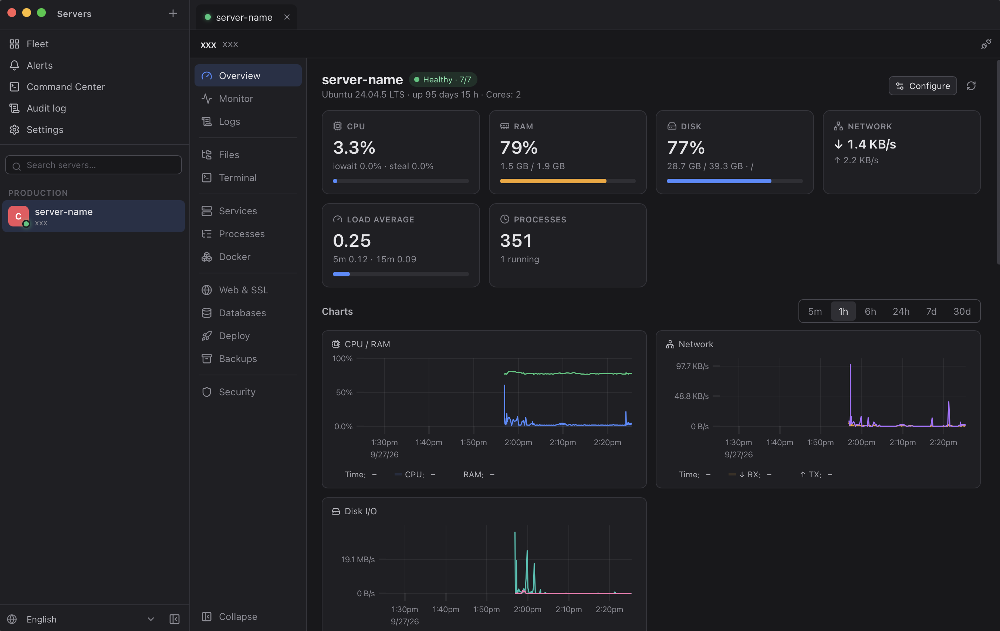
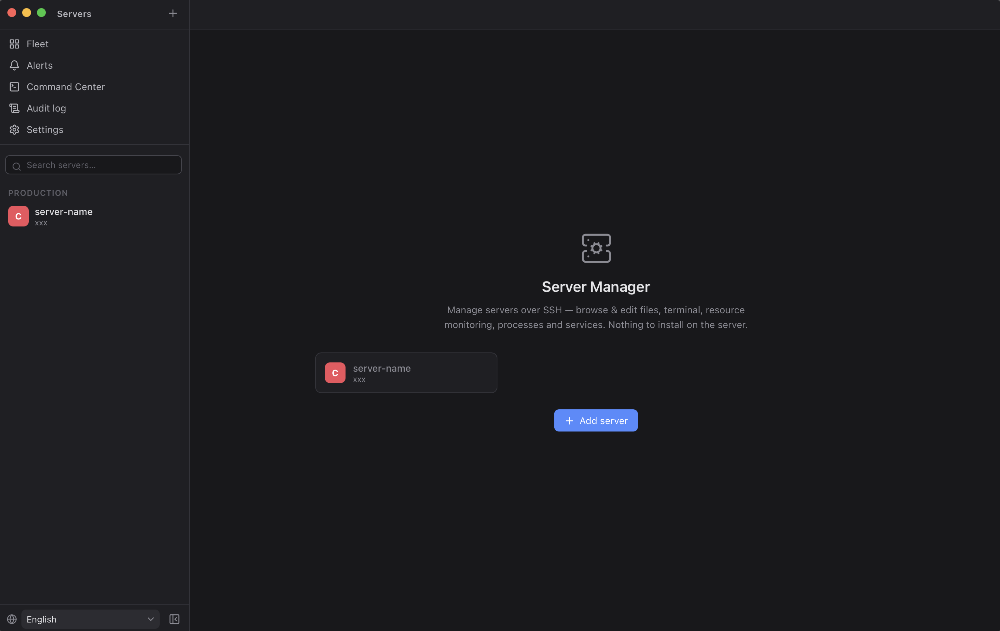
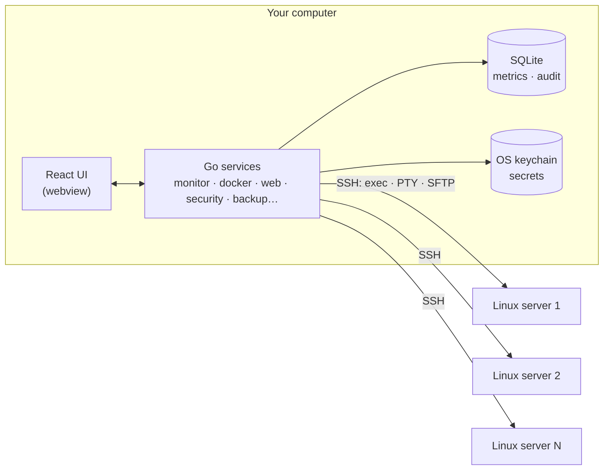

<div align="center">


# Server Manager

**Manage your Linux servers from one desktop app — over plain SSH, with nothing to install on the server.**

Monitoring, logs, terminal, files, Docker, deployments, Nginx/Caddy + SSL, databases, backups, firewall & fail2ban, alerts, a multi-server command center and an audit log — in one fast, native-feeling app.

[](LICENSE)


[](CONTRIBUTING.md)

English · [Tiếng Việt](README.vi.md)



</div>

> [!WARNING]
> **Alpha software, built largely with AI ("vibe-coded").** Most of this code was written together with an AI coding assistant. It has unit tests and integration tests that run against real Linux servers in Docker, but it has **not** been battle-tested in production across many distributions and setups. It runs commands as root on your servers — **try it on a staging server first**, read what an action does before confirming it, and please [report anything that breaks](../../issues). Contributions that add tests, review code or harden edge cases are the most valuable help right now.

## Why

Most server dashboards want something installed on the server: an agent, a web panel, a container with access to the Docker socket. Each one is another thing to update, secure and expose.

Server Manager takes the opposite route: **it only needs SSH**. Everything goes through the `sshd` you already run — exec, PTY and SFTP — and uses the tools the OS already has (`/proc`, `systemctl`, `journalctl`, `docker`, `nginx`, `ufw`, `psql`…). Close the app and the server is exactly as it was.

| | Server Manager | Cockpit / Webmin | Portainer | Plain SSH client |
|---|:-:|:-:|:-:|:-:|
| Nothing installed on the server | ✅ | ❌ (web panel on the server) | ❌ (agent / container) | ✅ |
| Monitoring + alerts | ✅ | partly | ❌ | ❌ |
| Docker, Compose, deployments | ✅ | plugin | ✅ | ❌ |
| Nginx/Caddy sites + Let's Encrypt | ✅ | partly | ❌ | ❌ |
| Firewall, fail2ban, SSH hardening | ✅ | partly | ❌ | ❌ |
| Many servers at once + audit log | ✅ | partly | partly | ❌ |
| No port opened besides SSH | ✅ | ❌ | ❌ | ✅ |

## Features

| Area | What you get |
|---|---|
| **Overview & monitoring** | Health summary ("7/7 checks OK"), CPU per core, iowait/steal, load, RAM/swap, disk space/inodes/IO/latency, network throughput/errors, top processes. History for 5m → 30d with zoomable charts. |
| **Health checks & alerts** | Rules on any metric with thresholds and durations, scoped by environment/group/tag/server. Pending → firing → acknowledged → resolved, with de-duplication and rate limits. Channels: Telegram, Slack, Discord, email (SMTP), signed webhooks, PagerDuty, desktop notifications. |
| **Logs** | journald, syslog, auth, kernel, Nginx, Docker, any file — level/time filters, regex search, live tail, virtualized view that stays smooth on 10k+ lines, download. |
| **Terminal** | Multiple tabs, search, console straight into containers and databases, session recording and replay, working Vietnamese input methods (Telex/VNI). |
| **Files** | Browse, upload/download, rename, chmod/chown, sudo, and a Monaco editor. *Save & reload* validates Nginx/Caddy/Apache/sshd/systemd configs first and rolls back if they are invalid. |
| **Services & processes** | systemd start/stop/restart/enable, details (PID, CPU, RAM, restarts, dependencies), auto-restart, logs; process list with kill. |
| **Docker** | Containers (stats, logs, exec, inspect, env, volumes, networks, recreate), images, volumes, networks; Compose edit → validate → deploy → rollback. |
| **Deployments** | Git or image-based apps with env vars and secrets: build → test → restart → health check, history and automatic rollback when the health check fails. |
| **Web & SSL** | Nginx/Caddy reverse proxies from a form (HTTPS redirect, HSTS, WebSocket, headers, rate limits, basic auth), config tested before applying. Let's Encrypt issue/renew/revoke, expiry tracking, custom certificates. |
| **Security** | Security score, safe sshd settings, authorized_keys, firewall (ufw / firewalld / iptables / nftables view), open ports, failed logins, sudo history, account changes. |
| **IP access control** | See who is brute-forcing SSH (grouped by /24), block many IPs or whole ranges in one click (permanent firewall rule or temporary fail2ban ban), allowlists, "SSH only from allowlisted IPs", and one-click fail2ban setup with incremental bans and the recidive jail. Your own IP is never blocked. |
| **Linux users** | Create/delete, lock/unlock, passwords, groups, sudo rights. |
| **Databases** | PostgreSQL, MySQL/MariaDB, Redis (host or Docker): status, connections, sizes, running and slow queries, a query runner that is read-only by default. |
| **Backups** | Files, PostgreSQL, MySQL, Docker volumes, Redis → local folder, the server or S3 (AWS, Backblaze B2, MinIO, Cloudflare R2…). age encryption, cron schedules, retention, integrity checks, restore. |
| **Fleet & Command Center** | Environments, tags, groups, regions, providers; run commands or presets on many servers with confirmation, dangerous-command detection, timeouts, parallelism limits and per-server results. |
| **Audit & roles** | Every change is logged (who, when, which server, what, result) in a SHA-256 hash chain, exportable to CSV. Per-server roles (Admin / Operator / Developer / Viewer) enforced in the backend; production servers require typing the server name for dangerous actions. |
| **Runs in the background** | Close the window and it keeps monitoring, alerting and running scheduled backups from the menu bar / system tray. |
| **10 languages** | English, Tiếng Việt, 简体中文, 日本語, 한국어, Français, Deutsch, Español, Português, Русский. |

<div align="center">



</div>

## Security model

- **Secrets stay in your OS keychain** (macOS Keychain, Windows Credential Manager, Secret Service on Linux). The local SQLite database only holds non-secret settings, metrics and the audit log.
- **Host keys are verified**: unknown hosts ask for confirmation, changed keys raise a warning.
- **No shell injection by construction**: every value placed into a remote command is validated and single-quoted; secrets travel on stdin, never on the command line (so they never show up in `ps`) and are masked in deployment logs.
- **Guard rails**: actions that could lock you out (firewall rules, sshd changes, removing your last key, blocking your own IP) are detected and refused or require explicit confirmation; config edits are validated and rolled back on failure.

Found a vulnerability? Please follow [SECURITY.md](SECURITY.md) instead of opening a public issue.

## Tech stack

| Layer | Technology |
|---|---|
| Desktop shell | [Wails v3](https://v3.wails.io) (Go backend + native webview, no Electron) |
| Backend | Go 1.26 · `golang.org/x/crypto/ssh` · `pkg/sftp` · SQLite ([modernc](https://pkg.go.dev/modernc.org/sqlite), pure Go) · [go-keyring](https://github.com/zalando/go-keyring) · [age](https://age-encryption.org) · [minio-go](https://github.com/minio/minio-go) (S3) · robfig/cron |
| Frontend | React 18 · TypeScript · Vite · [zustand](https://github.com/pmndrs/zustand) · [Monaco Editor](https://microsoft.github.io/monaco-editor/) · [xterm.js](https://xtermjs.org) · [uPlot](https://github.com/leeoniya/uPlot) · [lucide](https://lucide.dev) icons |
| On the server | Nothing new — `sshd` plus what the OS already ships |
| Tests | Go unit tests + integration tests against real Debian, Alpine and AlmaLinux (firewalld) servers in Docker (`testenv/`) |



## Getting started

There are no prebuilt releases yet — build it from source (it takes a couple of minutes).

**Requirements:** Go 1.26+, Node.js 20+, the [Wails v3 CLI](https://v3.wails.io/getting-started/installation/) and the platform prerequisites Wails lists (Xcode command line tools on macOS, WebKitGTK on Linux, WebView2 on Windows).

```bash
go install github.com/wailsapp/wails/v3/cmd/wails3@latest
git clone https://github.com/ChisThanh/Server-Manager.git
cd Server-Manager

wails3 dev        # run in development mode with hot reload
wails3 build      # build the app into bin/
wails3 package    # package it (.app / installer)
```

Then click **Add server**, enter `user@host[:port]` and a password, key or SSH agent. That's it — nothing gets installed on the server.

**Supported servers:** Linux with `sshd` — developed and tested on Debian/Ubuntu, Alpine and AlmaLinux/RHEL-family. Root or a `sudo`-capable account unlocks the admin features; a plain account still gets monitoring, logs, files and terminal.

**Supported desktops:** developed on macOS. Linux and Windows builds are supported by Wails but have seen very little testing — reports and fixes are welcome.

## Known limitations

- **Metrics history and alerts only exist while the app runs** (background mode keeps it running from the tray). Background monitoring needs the password/passphrase saved in the keychain, or a key/agent.
- **Roles are a local guard rail** on the machine running the app, not team-wide access control. Shared RBAC/SSO would need a small control-plane server — see the roadmap.
- Traefik is detected but not editable (it is configured through Docker labels).
- Wails v3 itself is still in beta.

## Roadmap

- [ ] Prebuilt, signed releases for macOS, Windows and Linux + auto-update
- [ ] Wider testing: Ubuntu LTS, Rocky/Alma, Fedora, Arch, openSUSE; Windows and Linux desktops
- [ ] Optional self-hosted control plane for teams (shared servers, RBAC, SSO)
- [ ] Native nftables editing, CrowdSec integration, Traefik support
- [ ] More database engines and backup targets
- [ ] Plugin API for custom panels

Have an idea? [Open a feature request](../../issues/new/choose).

## Contributing

This project is open source so that it can get better with more eyes on it. Bug reports, tests, reviews, translations and features are all welcome — start with [CONTRIBUTING.md](CONTRIBUTING.md). Issues labelled `good first issue` are a good place to begin.

The developer guide in [docs/DEV_GUIDE.md](docs/DEV_GUIDE.md) explains the architecture and conventions (how a module is structured, how commands are run safely, i18n, performance rules).

## License

[MIT](LICENSE) — free for personal and commercial use.

If Server Manager saves you time, a ⭐ on GitHub helps other people find it.
